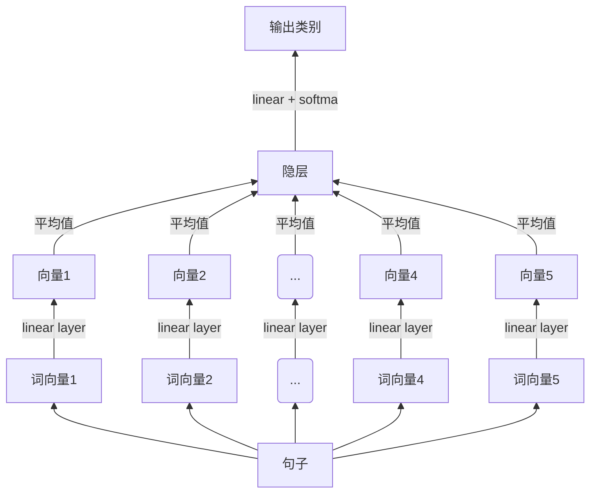
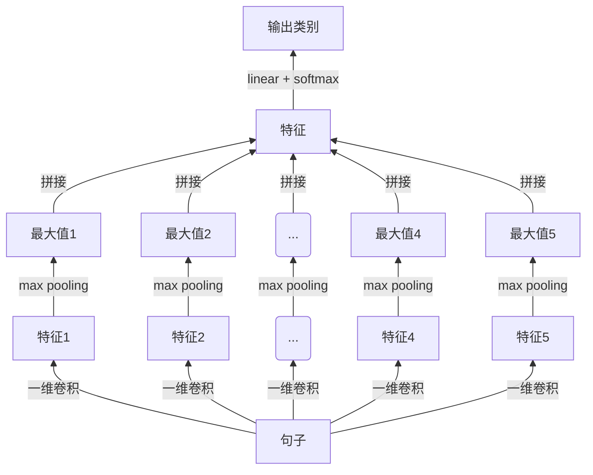
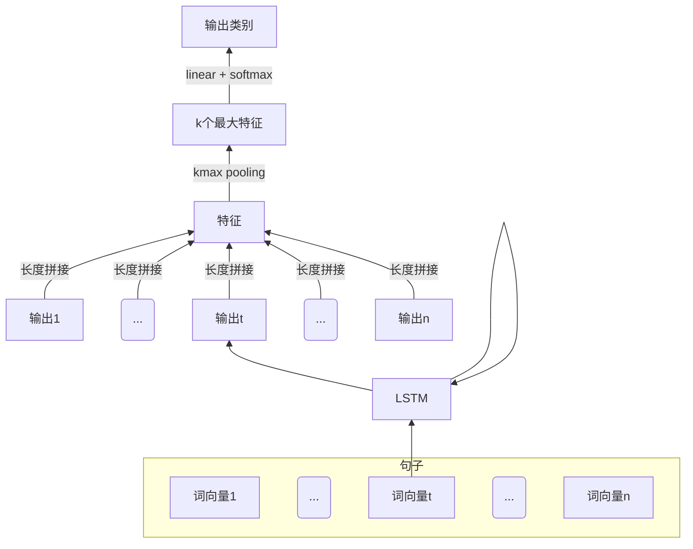
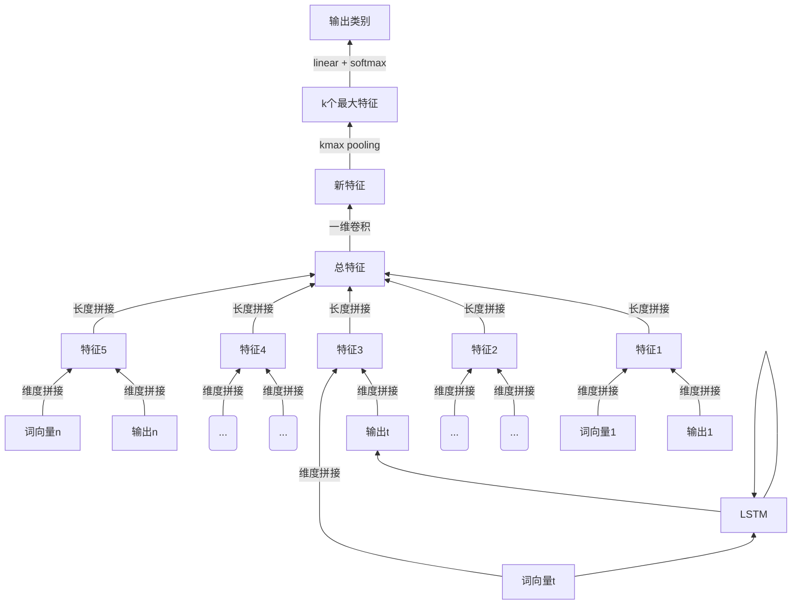

- [<center>NLP模型总结</center>](#centernlp%E6%A8%A1%E5%9E%8B%E6%80%BB%E7%BB%93center)
    - [FastText 模型](#fasttext-%E6%A8%A1%E5%9E%8B)
        - [结构图](#%E7%BB%93%E6%9E%84%E5%9B%BE)
        - [代码](#%E4%BB%A3%E7%A0%81)
    - [TextCNN 模型](#textcnn-%E6%A8%A1%E5%9E%8B)
        - [结构图](#%E7%BB%93%E6%9E%84%E5%9B%BE-1)
        - [代码](#%E4%BB%A3%E7%A0%81-1)
    - [LSTM 模型](#lstm-%E6%A8%A1%E5%9E%8B)
        - [结构](#%E7%BB%93%E6%9E%84)
        - [代码](#%E4%BB%A3%E7%A0%81-2)
    - [LSTM 和 CNN 混合模型](#lstm-%E5%92%8C-cnn-%E6%B7%B7%E5%90%88%E6%A8%A1%E5%9E%8B)
        - [结构](#%E7%BB%93%E6%9E%84-1)

# <center>NLP模型总结</center>

## FastText 模型
### 结构图


FastText模型十分简单，通过对每个词向量进行一次线性计算得到一个向量，将所以向量求平均值得到隐层向量，再进行一步线性计算得到分类结果。其原理在于假设相似含义的词汇具有相识的词向量，通过将词向量求平均可以得到句子的向量表达。

由于模型只把词向量求平均来表示句子含义，不考虑句子的结构，因此精度不是太高，在我的实验中最后 F1 score 为 **0.70**。

### 代码
```python
import torch
from torch import nn
import torch.nn.functional as F
import numpy as np

class FastText(nn.Module):
    def __init__(self, vocab_size, em_dim, ln_hddn_size, label_size, vectors=None):
        super(FastText, self).__init__()
        self.em_dim = em_dim
    
        self.embedding = nn.Embedding(vocab_size, em_dim)
        
        if vectors is not None:
            self.embedding.weight.data.copy_(vectors)

        self.pre = nn.Sequential(
            nn.Linear(em_dim, em_dim * 2),
            nn.BatchNorm1d(em_dim * 2),
            nn.ReLU(True)
        )

        self.fc = nn.Sequential(
            nn.Linear(em_dim * 2, ln_hddn_size),
            nn.BatchNorm1d(ln_hddn_size),
            nn.ReLU(inplace=True),
            nn.Linear(ln_hddn_size, label_size)
        )

    def forward(self, sentence):
        embed = self.embedding(sentence)  # seq * batch * emb
        embed_size = embed.size()
        out = self.pre(embed.contiguous().view(-1, self.em_dim)).view(embed_size[0], embed_size[1], -1)
        mean_out = torch.mean(out, dim=0).squeeze()  # batch * 2emb

        logit = self.fc(mean_out)
        return logit

```

## TextCNN 模型
### 结构图


TextCNN 和图像 CNN 最大的一个不同点就是它只有一层，我试过深层的 TextCNN，效果特别差，F1 socre 只有 0.3 左右。根据我的分析，文本和图像很不一样，图像大部分区域都是连续过渡的，通过卷积和max pooling可以提取出关键信息，而文本变化太多，一个词的改变都会有完全不一样的含义，通过卷积核找不到通用模式。因此现在的 TextCNN 模型都是通过增加卷积核数量，也就是增加模型的宽度的方式来提高精度，这相当于用大量的核去文本中寻找关键特征，基于这些特征来进行分类。

在我的实验中，TextCNN 模型最终 F1 score 为 **0.71**。

### 代码
```python
class TCNN(nn.Module):
    def __init__(self, vocab_size, em_dim, opt, vectors=None):
        super(TCNN, self).__init__()
        
        self.name = r'textcnn'
        
        ln_hddn_size = opt['ln_hddn_size']
        label_size = opt['label_size']
        kernel_num = opt['kernel_num']
        max_length = opt['max_length']
        
        kernal_sizes = [1, 2, 3, 4, 5]

        self.em_dim = em_dim
    
        '''Embedding Layer'''
        # 使用预训练的词向量
        self.embedding = nn.Embedding(vocab_size, em_dim)
        if vectors is not None:
            self.embedding.weight.data.copy_(vectors)

        convs = [
            nn.Sequential(
                nn.Conv1d(in_channels = em_dim,
                          out_channels=kernel_num,
                          kernel_size=kernel_size),
                nn.BatchNorm1d(kernel_num),
                nn.ReLU(inplace=True),

                nn.Conv1d(in_channels=kernel_num,
                          out_channels=kernel_num,
                          kernel_size=kernel_size),
                nn.BatchNorm1d(kernel_num),
                nn.ReLU(inplace=True),
                nn.MaxPool1d(kernel_size=(max_length - kernel_size*2 + 2))
            )
            for kernel_size in kernal_sizes
        ]

        self.convs = nn.ModuleList(convs)

        self.fc = nn.Sequential(
            nn.Linear(5 * kernel_num, ln_hddn_size),
            nn.BatchNorm1d(ln_hddn_size),
            nn.ReLU(inplace=True),
            nn.Linear(ln_hddn_size, label_size)
        )

    def forward(self, inputs):
        embeds = self.embedding(inputs)  # seq * batch * embed
        # 进入卷积层前需要将Tensor第二个维度变成emb_dim，作为卷积的通道数
        conv_out = [conv(embeds.permute(1, 2, 0)) for conv in self.convs]
        conv_out = torch.cat(conv_out, dim=1)

        flatten = conv_out.view(conv_out.size(0), -1)
        logits = self.fc(flatten)
        return logits
```

## LSTM 模型
### 结构


这是一个单层的LSTM模型，暂时还没有测试多层LSTM模型。LSTM模型可以缓解长句子训练中的梯度扩散问题。在实验中，LSTM模型精度随迭代周期上升很慢，但一直在缓慢上升，最终 F1 score 能达到 **0.732**。

### 代码
```python
import torch
from torch import nn
import torch.nn.functional as F
import numpy as np

class LSTM(nn.Module):
    def __init__(self, vocab_size, em_dim, opt, vectors=None):
        super(LSTM, self).__init__()
        
        self.name = r'single_lstm'
        
        hddn_dim = opt['hidden_dim']
        layer_num = opt['lstm_layer_num']
        ln_hddn_size = opt['ln_hddn_size']
        label_size = opt['label_size']
        
        
        self.kmax_k = 2
        self.em_dim = em_dim
    
        self.embedding = nn.Embedding(vocab_size, em_dim)
        
        if vectors is not None:
            self.embedding.weight.data.copy_(vectors)

        self.lstm = nn.LSTM(
            input_size=em_dim,
            hidden_size=hddn_dim,
            num_layers=layer_num,
            batch_first=False,
            dropout=0.5,
            bidirectional=True
        )
        

        # classifer
        # self.fc = nn.Linear(2 * (100 + 100), args.label_size)
        self.fc = nn.Sequential(
            nn.Linear(2*self.kmax_k*hddn_dim, ln_hddn_size),
            nn.BatchNorm1d(ln_hddn_size),
            nn.ReLU(inplace=True),
            nn.Linear(ln_hddn_size, label_size)
        )

    def forward(self, sentence):
        embed = self.embedding(sentence)
        out = self.lstm(embed)[0].permute(1, 2, 0)
        k_out = self.kmax_pooling(out, 2, self.kmax_k)

        flatten = k_out.view(k_out.size(0), -1)
        logits = self.fc(flatten)
        return logits
            
    def kmax_pooling(self, x, dim, k):
        index = x.topk(k, dim=dim)[1].sort(dim=dim)[0]
        return x.gather(dim, index)
```

## LSTM 和 CNN 混合模型
### 结构

该模型将 LSTM 和 CNN 相结合，收敛速度比单纯 LSTM 快，但最终精度差不多。在实验中，该混合模型最终 F1 score 为 **0.735**。

###代码
```python
import torch
from torch import nn
import torch.nn.functional as F
import numpy as np


class LSTM(nn.Module):
    def __init__(self, vocab_size, em_dim, opt, vectors=None):
        super(LSTM, self).__init__()
        
        self.name = r'lstm'
        
        hddn_dim = opt['hidden_dim']
        layer_num = opt['lstm_layer_num']
        ln_hddn_size = opt['ln_hddn_size']
        label_size = opt['label_size']
        
        
        self.kmax_k = 2
        self.em_dim = em_dim
    
        self.embedding = nn.Embedding(vocab_size, em_dim)
        
        if vectors is not None:
            self.embedding.weight.data.copy_(vectors)

        self.lstm = nn.LSTM(
            input_size=em_dim,
            hidden_size=hddn_dim,
            num_layers=layer_num,
            batch_first=False,
            dropout=0.5,
            bidirectional=True
        )
        
        self.conv = nn.Sequential(
            nn.Conv1d(in_channels=hddn_dim * 2 + em_dim, out_channels=200, kernel_size=3),
            nn.BatchNorm1d(200),
            nn.ReLU(inplace=True),
            nn.Conv1d(in_channels=200, out_channels=200, kernel_size=3),
            nn.BatchNorm1d(200),
            nn.ReLU(inplace=True)
        )

        # classifer
        # self.fc = nn.Linear(2 * (100 + 100), args.label_size)
        self.fc = nn.Sequential(
            nn.Linear(2 * 200, ln_hddn_size),
            nn.BatchNorm1d(ln_hddn_size),
            nn.ReLU(inplace=True),
            nn.Linear(ln_hddn_size, label_size)
        )

    def forward(self, sentence):
        embed = self.embedding(sentence)
        out = self.lstm(embed)[0].permute(1, 2, 0)
        out = torch.cat((out, embed.permute(1, 2, 0)), dim=1)
        conv_out = self.kmax_pooling(self.conv(out), 2, self.kmax_k)

        flatten = conv_out.view(conv_out.size(0), -1)
        logits = self.fc(flatten)
        return logits
            
    def kmax_pooling(self, x, dim, k):
        index = x.topk(k, dim=dim)[1].sort(dim=dim)[0]
        return x.gather(dim, index)
```